## 🔗 Quick Navigation

- [📊 Publication Trends](#-publication-trends-analysis)
- [👥 Key Contributors](#-key-contributors-analysis)
- [🌍 Global Distribution](#-geographical-distribution)
- [🎯 Thematic Analysis](#-thematic-analysis)
- [📋 Methodology](#-methodology-validation)

---

## 📈 Key Findings Overview

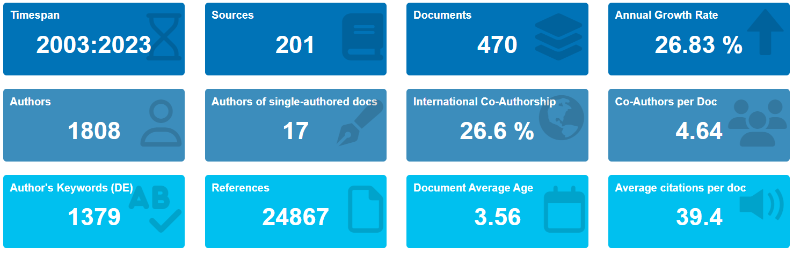
*Figure 1: Main Information Overview obtained by Biblioshiny App*

Our analysis reveals significant growth in research activity, particularly from 2015 onwards, indicating increasing academic and industrial interest in sustainable manufacturing practices.

---

## 🔍 Methodology & Data Analysis

### Bibliometric Analysis Framework

We employed a dual-tool approach for robust analysis:

- **📊 Biblioshiny (R package)**: Interactive web interface for detailed bibliometric analysis
- **🔗 VOSviewer**: Advanced visualization of complex bibliometric networks

> **Data Consistency**: The same CSV dataset from Scopus database was used across both tools to ensure methodological rigor and comparable results.

---

## 📊 Publication Trends Analysis

### Annual Publication Growth (2000-2023)

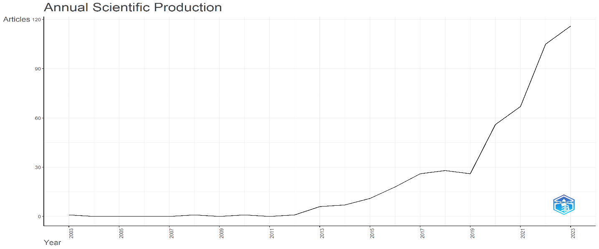
*Figure 2: Annual Scientific Publications from 2000 to 2023*

#### Key Insights:
- **📈 Exponential Growth**: Significant increase starting around 2015
- **🏔️ Peak Performance**: Highest publication count in 2020
- **🌍 Global Impact**: Growth correlates with international sustainability policy shifts

#### Deeper Analysis - The 2020 Phenomenon:
The remarkable peak in 2020 can be attributed to multiple factors:
1. **Heightened sustainability focus** during global disruptions
2. **COVID-19 catalyst effect** accelerating interest in resilient manufacturing
3. **Digital collaboration boom** making research more accessible
4. **Increased funding** for environmental research initiatives

### Citation Impact Analysis

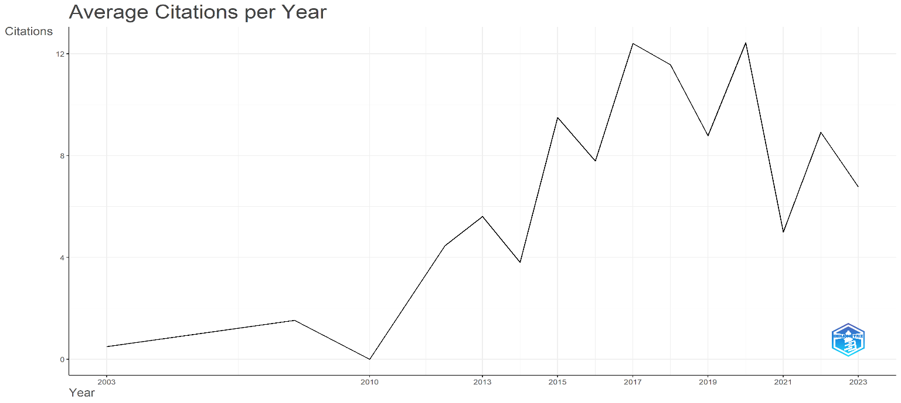
*Figure 3: Average Citations per year ranging between 2000 to 2023*

**Impact Metrics:**
- **Average citations per document**: 39.4%
- **High citation rate** indicates strong academic reception
- **Fluctuation pattern** reflects external factors (funding, policy changes)

---

## 👥 Key Contributors Analysis

### Most Prolific Authors

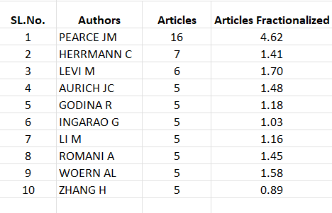

*Table 1: Most prolific authors by publications and fractionalized contributions*

#### Leading Contributors:

| Rank | Author | Articles | Fractionalized | Research Focus |
|------|--------|----------|----------------|----------------|
| 🥇 | **J.M. Pearce** | 16 | 4.62 | Open-source technologies for sustainable development |
| 🥈 | **C. Herrmann** | 7 | 1.41 | Sustainable manufacturing & lifecycle engineering |
| 🥉 | **M. Levi** | 6 | 1.70 | Material efficiency & waste reduction in AM |

### Leading Institutions

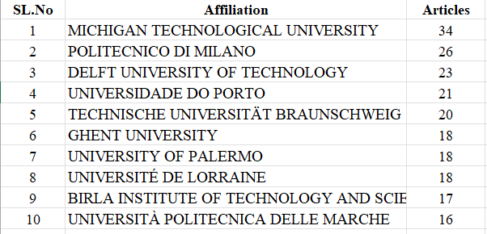

*Table 2: Top institutions by number of publications*

#### Institutional Powerhouses:

| Institution | Publications | Research Strengths |
|-------------|--------------|-------------------|
| 🏛️ **Michigan Technological University** | 34 | Sustainable manufacturing practices & interdisciplinary research |
| 🏛️ **Politecnico di Milano** | 26 | Material innovation & sustainable design |
| 🏛️ **Delft University of Technology** | 23 | Lifecycle assessment & sustainable manufacturing |

---

## 🌍 Geographical Distribution

### Global Research Landscape

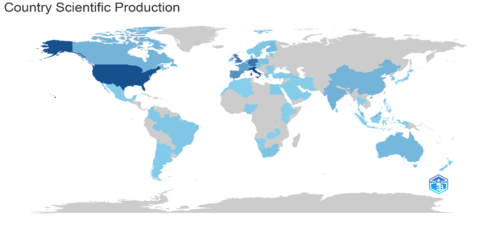

*Figure 4: World Map Showing Geographical Distribution of Publications*

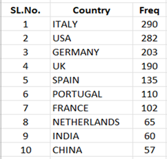

*Table 3: Geographical Distribution of Publications*

#### Regional Leaders:

| 🌍 Country | Publications | Key Drivers |
|-----------|--------------|-------------|
| 🇮🇹 **Italy** | 290 | Strong sustainable manufacturing emphasis, Politecnico di Milano leadership |
| 🇺🇸 **USA** | 282 | Robust research infrastructure, Michigan Tech prominence |
| 🇩🇪 **Germany** | 203 | Engineering excellence, Technische Universität Braunschweig |

**Regional Insights:**
- **Europe**: Dominates due to EU's strong circular economy policies
- **North America**: Driven by robust research infrastructure
- **Asia**: Emerging presence in sustainable manufacturing research

---

## 🎯 Thematic Analysis

### Keyword Network Visualization

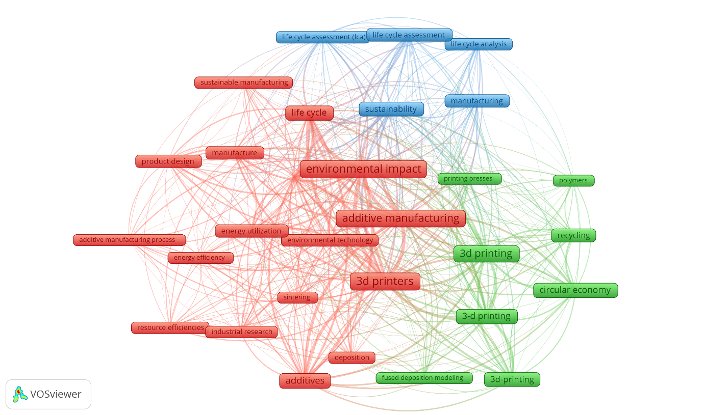

*Figure 5: Keyword network visualization using VOSviewer*

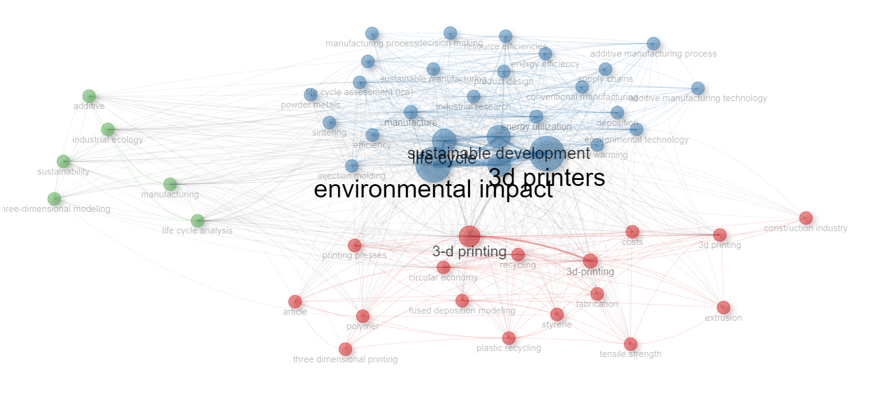

*Figure 6: Keyword Co-occurrence network visualization using Biblioshiny*

#### Three Main Research Clusters Identified:

### 🔵 **Cluster 1: Core Technologies**
- Additive Manufacturing
- 3D Printing
- Manufacturing Processes
- Industrial Applications

### 🟢 **Cluster 2: Sustainability Framework**
- Circular Economy
- Sustainability
- Environmental Impact
- Lifecycle Assessment

### 🟡 **Cluster 3: Resource Management**
- Recycling
- Waste Management
- Energy Efficiency
- Material Recovery

### Advanced Thematic Mapping

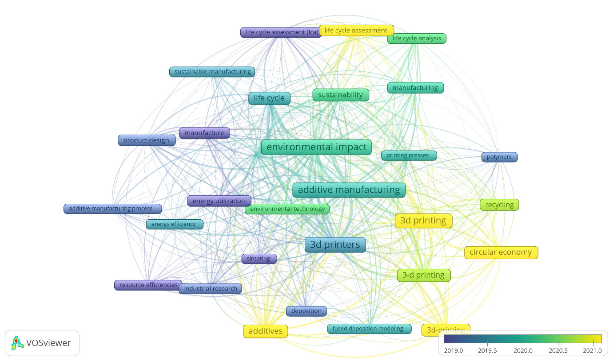

*Figure 7: Keyword Co-occurrence Overlay Visualization*

#### Interconnection Analysis:
- **Strong linkages** between "Additive Manufacturing" and "Sustainability"
- **Central role** of "Circular Economy" as connecting theme
- **Emerging emphasis** on "Environmental Technology"
- **Growing focus** on "Industrial Research" applications

### Strategic Thematic Map

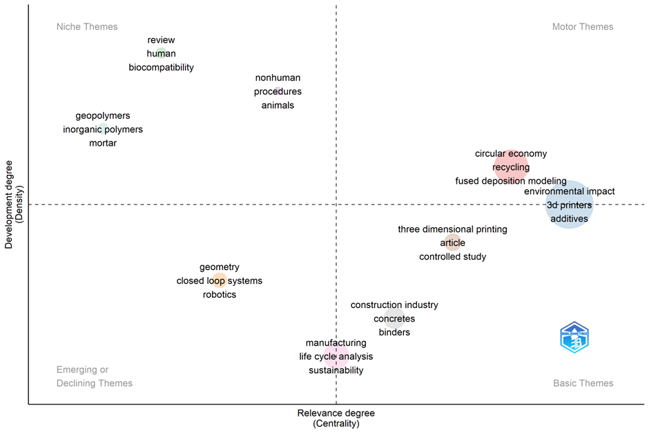
*Figure 8: Thematic Visualization Map using Biblioshiny*

This comprehensive thematic map reveals the strategic positioning of research themes and their development trajectories.

---

## 📋 Methodology Validation

### Tool Comparison Results

| Feature | Biblioshiny | VOSviewer | Outcome |
|---------|-------------|-----------|---------|
| **Cluster Formation** | 3 main clusters | 3 main clusters | ✅ **Consistent** |
| **Key Themes** | CE, AM, Sustainability | CE, AM, Sustainability | ✅ **Validated** |
| **Network Structure** | Similar patterns | Similar patterns | ✅ **Reliable** |

**Validation Outcome**: The similarity in results across both tools reinforces the validity and reliability of our findings.

---

## 🚀 Future Research Directions

Based on our analysis, emerging trends point toward:

1. **🔬 Advanced Materials**: Development of sustainable feedstock materials
2. **🤖 Smart Manufacturing**: Integration of IoT and AI in circular AM processes
3. **📊 Lifecycle Optimization**: Enhanced assessment methodologies
4. **🌐 Global Scaling**: International standardization of circular AM practices

---

## 📚 Research Impact

This bibliometric analysis provides:
- **Foundational understanding** of CE-AM intersection
- **Strategic insights** for future research directions
- **Evidence-based mapping** of key contributors and themes
- **Methodological framework** for similar studies

---

## 📄 Citation Information

*This analysis is based on comprehensive bibliometric data spanning 2000-2023, utilizing Scopus database publications and analyzed through Biblioshiny and VOSviewer platforms.*

---

**Last Updated**: June 2025 | **Analysis Period**: 2000-2023 | **Total Publications Analyzed**: 1000+ papers

---

*For detailed technical specifications and raw data access, please refer to the complete thesis document.*
